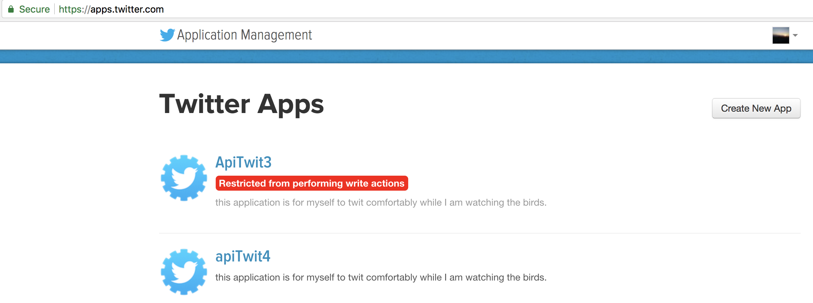
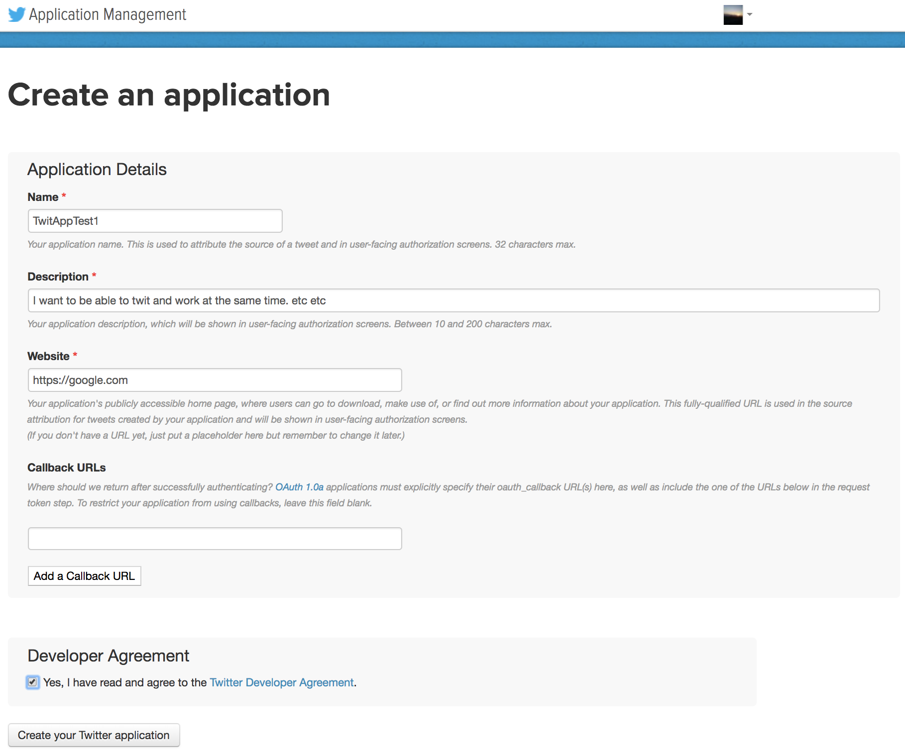
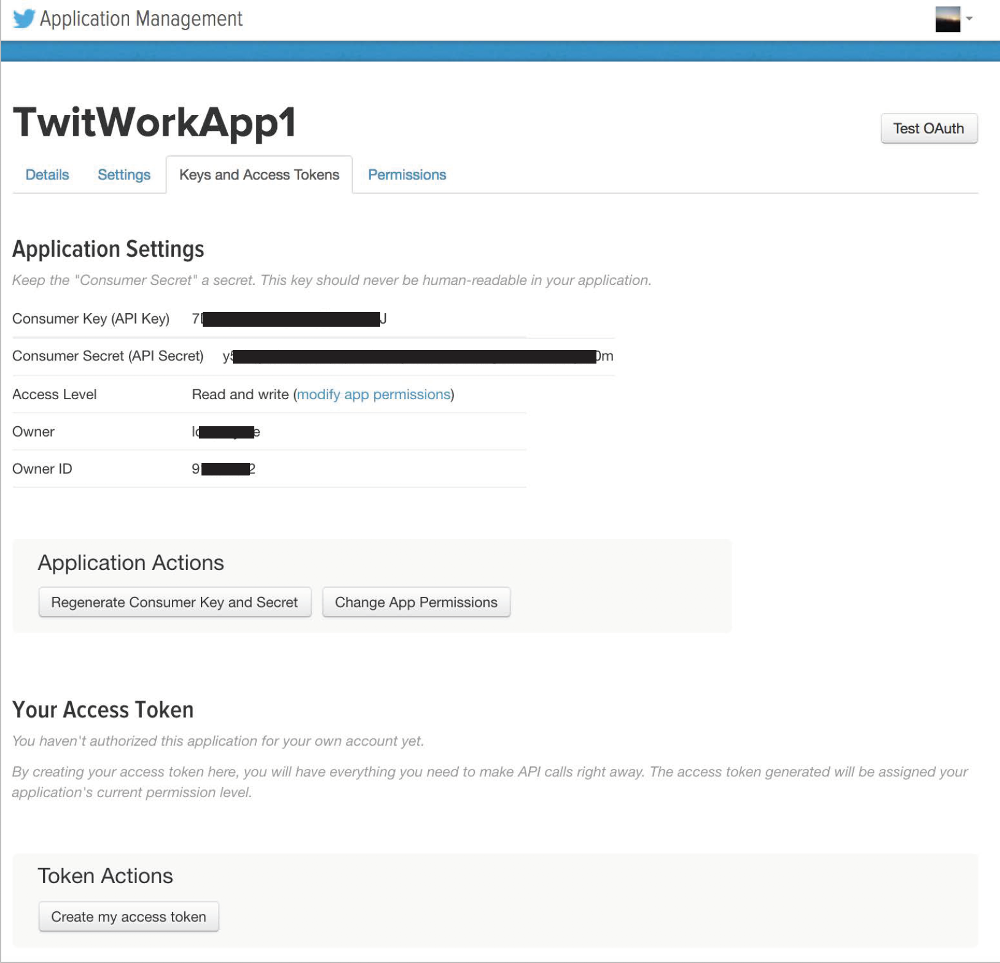
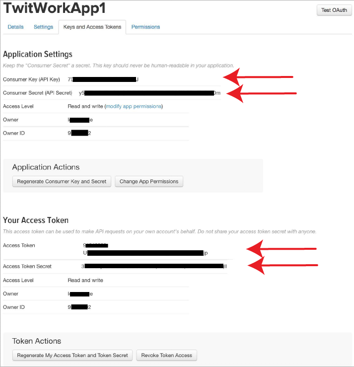

# HandsFreeTweet
This repository provides a collection of codes for tweeting while working...
**autoTweet.py** merges given hashtags with your tweets and inserts mentions randomly with a rate which will not anger twitter API.
**autoReTweet.py** searches for tweets with certain hashtags and re-tweets them upto a certain number.

### How to install:
Assuming that you already have python installed in your computer.

**First**, you need to __install tweepy__ module:

```
sudo pip install tweepy
```
or
```
git clone https://github.com/tweepy/tweepy.git
cd tweepy
sudo python setup.py install
```
You can also follow the instructions here: https://github.com/tweepy/tweepy

And please __install Configparser__

```
pip install configparser
```


**Then**, download this code to your computer by typing the following:
```
git clone https://github.com/yasinkaymaz/HandsFreeTweet.git

cd HandsFreeTweet
```

Now it is ready to use.

Before running the script, make sure that all input files are in the same folder (HandsFreeTweet) as autoTweet.py!

```
cd HandsFreeTweet

python autoTweet.py -c credentials.ini -m TweetPool.txt -p people.txt -t Hashtags.txt -b banners.txt
```

Or simply run as below if you already have input files stored in the execution folder:

```
python autoTweet.py
```

---

### What files you need:

#### 1. Prepare a file for your twitter application account credentials :

**First**, create an application from https://apps.twitter.com/

**Step 1:**



---

**Step 2: Fill the form and create the application.**



---

**Step 3: Navigate to Keys and Access Token tab, and create "my access token" far below.**



---

**Step 4: Copy all 4 strings and paste into a text file (credentials.ini) as instructed below.** consumer_key, consumer_secret, access_token, access_token_secret



---

Create a file which stores these in the order: **ApplicationName**, **consumer_key**, **consumer_secret**, **access_token**, **access_token_secret**

Example credentials.ini file:

```
$cat credentials.ini

[Account01]
username			: TwitWorkApp1
consumer_key        : 3RD4iElfk5Qyu22PRCQq6to4j
consumer_secret     : 1rZvVMnRKkBqYKNyx9G84rv3CdcHa0p4XdHl23JQua0ijf
access_token        : 1003735820948571226309-snSxi0ILFOWflsj201H0kwlXf5MJmox6
access_token_secret : 6XLOiy5IbKZPUeKfl39fSLiIDHJ2heTQrlywPuqbetUlYB

[Account02]
username			: TwitWorkApp1
consumer_key        : 9wqZlB5h2PRCQd9wl3TaxlR
consumer_secret     : X7Nm3OhCBaELjfMcWMnRKkBqY78XaHh2R6VwMDMipjfL9v
access_token        : 1003735209485718226309-H7w5WCqdlDZRPnOWflsj201zaRP6mWJ
access_token_secret : 0PP4Zyq1rzH39fSLiIDHJRGWyFc86uNigTOXQOtSwtL9

...
```

#### OPTIONAL: Download the required files

Using this link you can download the rest of the files and modify them according to your preference.
https://drive.google.com/drive/folders/1_-fSR8-6Rn5Iv9dKSlVm6uTELn7rQC2g

__Please don't forget to change the directories in the banners.txt file.__

#### OR follow the guidelines below to create each of those yourself..


#### 2. Second file you need is a text file in which you store your tweets: one tweet text per line.
Put your tweets into this file. Please don't include any @s and #s in this file. Just plain text.
```
$cat TweetPool.txt

I want to fly today!
Happy tweets everybody..
Hello world, I am friendly.

...
```

#### 3. Third file you need is a text file which contains one hashtag of interest per line:
Hashtags.txt; Put your #hashtags you want to attach to your tweets into this file.

```
$ cat Hashtags.txt

#LifeisLife
#MondaySyndrome
#PartyTime

...

```

#### 4. Fourth file you need is a text file which contains tags per line:
people.txt; Put your target @twitter_users to which you want to send your tweets.

```
$ cat people.txt

@MartinLutherKing
@AlbertEinstein
@AdrianaLima
@MarkZukerberg

...
```

#### 5. Fifth file you need is a text file which stores names if banner (image) files with full directories.
banners.txt; Please put the full directories of files on your local computer.

```
$ cat banners.txt

/Users/cooluser/Documents/Banners/Ban1.jpg
/Users/cooluser/Documents/Banners/Ban2.jpg
/Users/cooluser/Documents/Banners/Ban3.jpg
/Users/cooluser/Documents/Banners/Ban4.jpg
/Users/cooluser/Documents/Banners/Ban5.jpg
/Users/cooluser/Documents/Banners/Ban6.jpg
/Users/cooluser/Documents/Banners/Ban7.jpg

...

```

---

## Start Running your autoTweeting motor.

**Happy Tweetings!!!**
