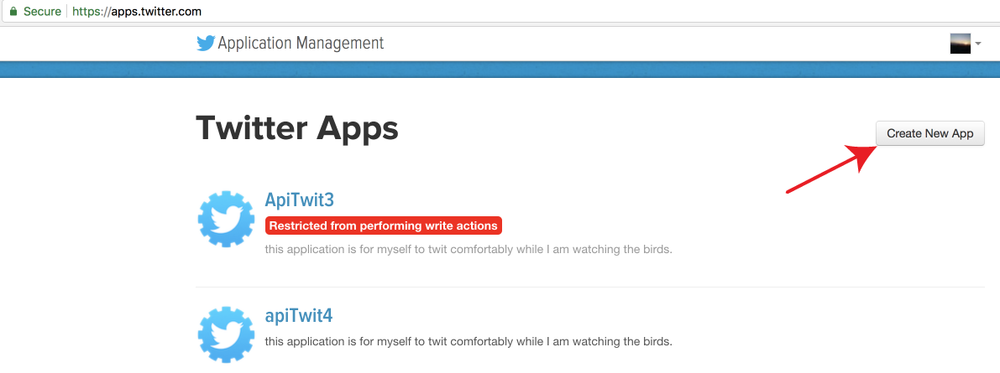
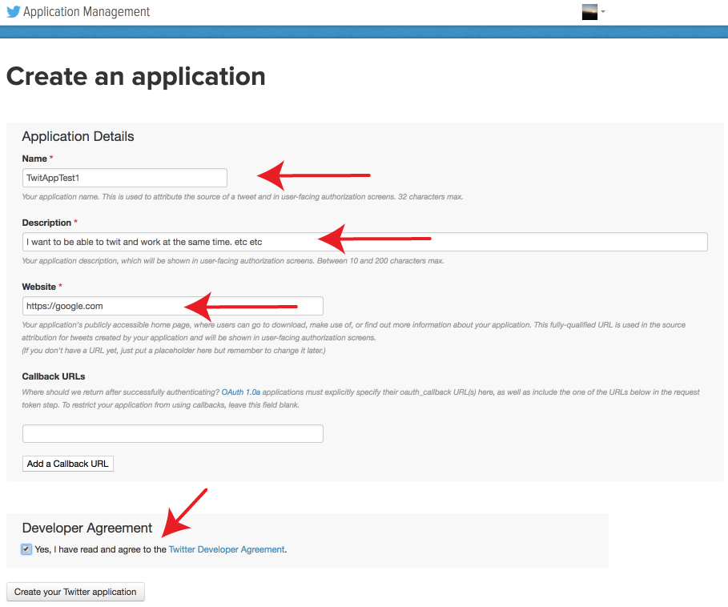
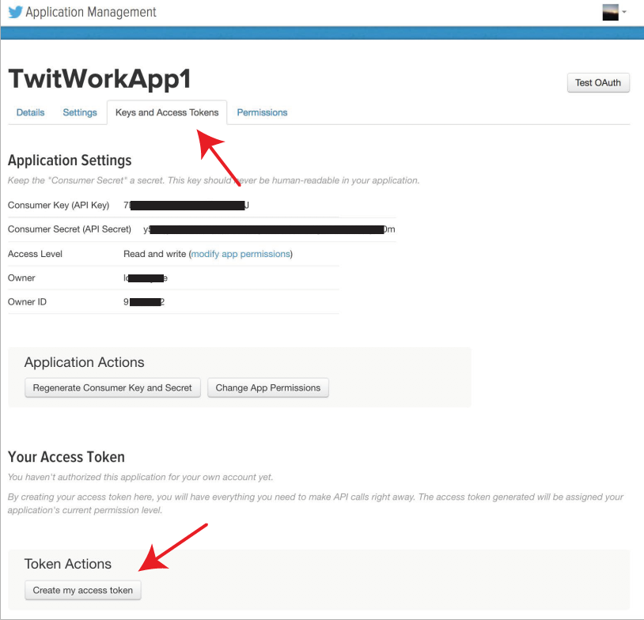

# HandsFreeTweet
This repository provides a collection of codes for tweeting while working...
**autoTweet.py** merges given hashtags with your tweets and inserts mentions randomly with a rate which will not anger twitter API.
**autoReTweet.py** searches for tweets with certain hashtags and re-tweets them upto a certain number.

### How to install:
Assuming that you already have python installed in your computer.

**First**, you need to install tweepy module:

```
sudo pip install tweepy
```
or
```
git clone https://github.com/tweepy/tweepy.git
cd tweepy
sudo python setup.py install
```
You can also follow the instructions here: https://github.com/tweepy/tweepy

**Then**, download this code to your computer by typing the following:
```
git clone https://github.com/yasinkaymaz/HandsFreeTweet.git

cd HandsFreeTweet
```

Now it is ready to use.

---

### What files you need:

#### 1. Prepare a file for your twitter application account credentials :

**First**, create an application from https://apps.twitter.com/

**Step 1:**



**Step 2: Fill the form and create the application.**



**Step 3: Navigate to Keys and Access Token tab, and create "my access token" far below.**



**Step 4: Copy all 4 strings and paste into a text file (tokenKeyFile.txt) as instructed below.** consumer_key, consumer_secret, access_token, access_token_secret


Create a tab separated tab file which contains in the __exact__ order: **ApplicationName**, **consumer_key**, **consumer_secret**, **access_token**, **access_token_secret**

**Attention!**: This file has to be only 1 line!
Example tokenKeyFile.txt file (tab separated):

```
$cat tokenKeyFile.txt

TwitWorkApp1	3RD4iElfk5Qyu22PRCQq6to4j	1rZvVMnRKkBqYKNyx9G84rv3CdcHa0p4XdHl23JQua0ijf	1003735820948571226309-snSxi0ILFOWflsj201H0kwlXf5MJmox6	6XLOiy5IbKZPUeKfl39fSLiIDHJ2heTQrlywPuqbetUlYB
```

#### 2. Second file you need is a text file in which you store your tweets: one tweet text per line.
Put your tweets into this file. Please don't include any @s and #s in this file. Just plain text.
```
$cat TweetPool.txt

I want to fly today!
Happy tweets everybody..
Hello world, I am friendly.
...
```

#### 3. Third file you need is a text file which contains one hashtag of interest per line:
Hashtags.txt; Put your #hashtags you want to attach to your tweets into this file.

```
$ cat Hashtags.txt

#LifeisLife
#MondaySyndrome
#PartyTime
...

```

#### 4. Fourth file you need is a text file which contains tags per line:
Mentiontags.txt; Put your target @twitter_users to which you want to send your tweets.

```
$ cat Mentiontags.txt

@MartinLutherKing
@AlbertEinstein
@AdrianaLima
@MarkZukerberg
...
```

---

## Start Running your autoTweeting motor.
Before running the script, make sure that all input files are in the same folder (HandsFreeTweet) as autoTweet.py!

```
cd HandsFreeTweet

python autoTweet.py tokenKeyFile.txt Tweetpool.txt Hashtags.txt Mentiontags.txt
```

**Happy Tweetings!!!**
